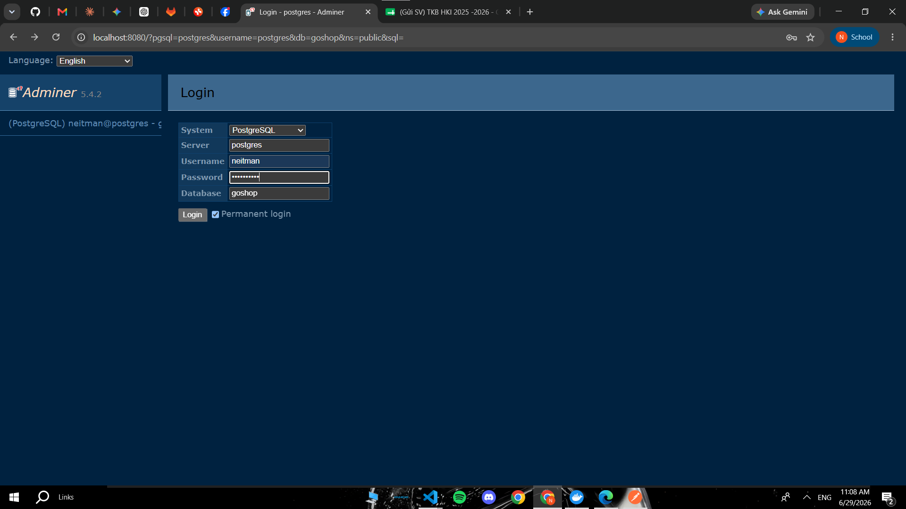
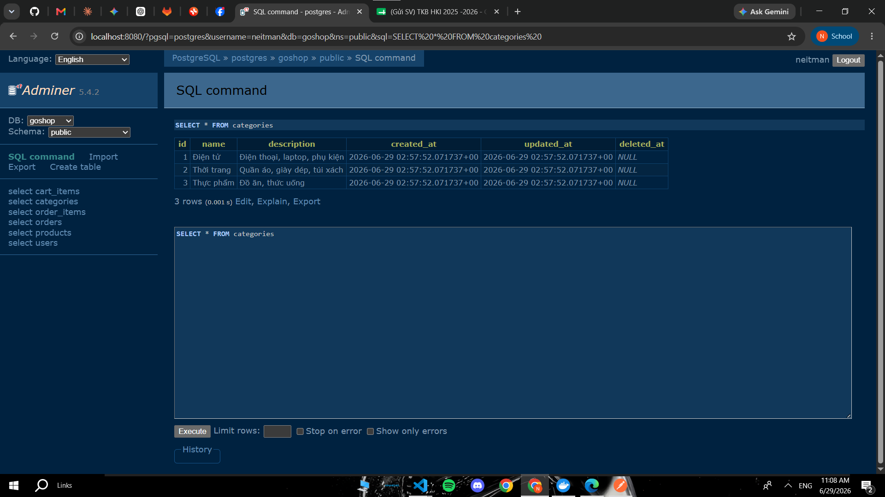
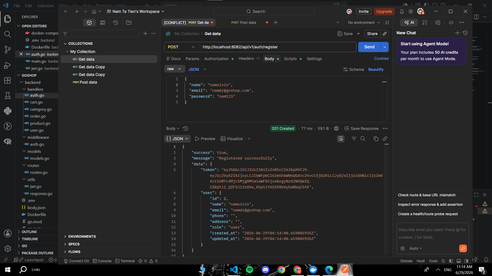
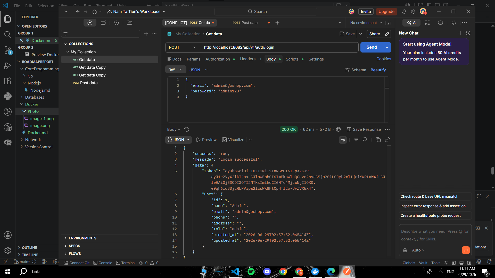

# Docker

---

## 1. Giới Thiệu

**Docker** là nền tảng container hóa (containerization) cho phép đóng gói ứng dụng cùng toàn bộ dependencies vào một đơn vị độc lập gọi là **container**. Container chạy nhất quán trên mọi môi trường — từ máy local, staging đến production.

**Tại sao dùng Docker:**

| Vấn đề không có Docker | Giải pháp với Docker |
|------------------------|----------------------|
|Chỉ chạy tốt trên máy cá nhân | Môi trường đồng nhất mọi nơi |
| Cài dependencies phức tạp | Đóng gói sẵn trong image |
| Xung đột phiên bản | Mỗi container độc lập |
| Deploy khó khăn | Build once, run anywhere |

---

## 2. Concepts

### 2.1 Containers

**Container** là một tiến trình được cô lập, chứa ứng dụng và mọi thứ nó cần để chạy. Nhẹ hơn VM vì dùng chung kernel của host OS.

```
VM:                          Container:
┌─────────────────────┐      ┌─────────────────────┐
│  App A  │  App B    │      │  App A  │  App B    │
│  Libs   │  Libs     │      │  Libs   │  Libs     │
│  OS     │  OS       │      ├─────────────────────┤
│─────────────────────│      │    Docker Engine    │
│    Hypervisor       │      │─────────────────────│
│─────────────────────│      │      Host OS        │
│      Host OS        │      └─────────────────────┘
└─────────────────────┘
~GBs, khởi động chậm         ~MBs, khởi động <1s
```

**Các lệnh container cơ bản:**

```bash
# Chạy container
docker run nginx
docker run -d -p 8080:80 --name my-nginx nginx   # chạy nền, map port

# Quản lý container
docker ps                    # xem container đang chạy
docker ps -a                 # xem tất cả container
docker stop my-nginx
docker start my-nginx
docker restart my-nginx
docker rm my-nginx           # xóa container

# Truy cập vào container
docker exec -it my-nginx bash

# Xem logs
docker logs my-nginx
docker logs -f my-nginx      # follow logs real-time
```

### 2.2 Images

**Image** là template read-only dùng để tạo container. Image được xây dựng theo từng lớp (layer), mỗi lệnh trong Dockerfile tạo một layer mới.

```bash
# Tìm kiếm image
docker search nginx

# Pull image từ Docker Hub
docker pull node:20-alpine
docker pull postgres:16

# Xem các image đã tải
docker images

# Xóa image
docker rmi nginx
docker image prune -a        # xóa tất cả image không dùng

# Xem chi tiết image
docker inspect node:20-alpine
docker history node:20-alpine  # xem các layer
```

**Các base image phổ biến:**

| Image | Kích thước | Dùng cho |
|-------|-----------|---------|
| `alpine` | ~5MB | Base nhỏ gọn |
| `node:20-alpine` | ~180MB | Node.js app |
| `golang:1.22-alpine` | ~250MB | Go app |
| `postgres:16` | ~400MB | PostgreSQL |
| `redis:7-alpine` | ~30MB | Redis |
| `nginx:alpine` | ~40MB | Web server / Reverse proxy |

### 2.3 Dockerfile

**Dockerfile** là file văn bản chứa các lệnh để build một image tùy chỉnh.

**Dockerfile cho Node.js app:**

```dockerfile
# Base image
FROM node:20-alpine

# Thư mục làm việc trong container
WORKDIR /app

# Copy package files trước (tận dụng layer cache)
COPY package*.json ./

# Cài dependencies
RUN npm ci --only=production

# Copy source code
COPY . .

# Build TypeScript (nếu dùng TS)
RUN npm run build

# Expose port
EXPOSE 3000

# Lệnh chạy khi container khởi động
CMD ["node", "dist/main.js"]
```

**Dockerfile cho Go app:**

```dockerfile
# Multi-stage build — tách build và runtime
# Stage 1: Build
FROM golang:1.22-alpine AS builder

WORKDIR /app
COPY go.mod go.sum ./
RUN go mod download

COPY . .
RUN CGO_ENABLED=0 GOOS=linux go build -o main ./cmd/server

# Stage 2: Runtime (image nhỏ gọn)
FROM alpine:latest

RUN apk --no-cache add ca-certificates
WORKDIR /root/

COPY --from=builder /app/main .

EXPOSE 8080
CMD ["./main"]
```

**Các lệnh Dockerfile quan trọng:**

| Lệnh | Mô tả |
|------|-------|
| `FROM` | Base image |
| `WORKDIR` | Thư mục làm việc |
| `COPY` | Copy file từ host vào image |
| `RUN` | Chạy lệnh khi build image |
| `ENV` | Đặt biến môi trường |
| `EXPOSE` | Khai báo port (tài liệu) |
| `CMD` | Lệnh mặc định khi chạy container |
| `ENTRYPOINT` | Lệnh chính không thể override |

```bash
# Build image từ Dockerfile
docker build -t my-app:1.0 .
docker build -t my-app:latest -f Dockerfile.prod .

# Push image lên Docker Hub
docker tag my-app:latest username/my-app:latest
docker push username/my-app:latest
```

**.dockerignore — tránh copy file không cần thiết:**

```
node_modules/
.git/
.env
*.log
dist/
coverage/
```

### 2.4 Docker Compose

**Docker Compose** cho phép định nghĩa và chạy nhiều container cùng lúc bằng file `docker-compose.yml`.

```yaml
# docker-compose.yml
version: '3.9'

services:
  # API Service
  api:
    build: .
    container_name: my-api
    ports:
      - "3000:3000"
    environment:
      - NODE_ENV=development
      - DATABASE_URL=postgresql://postgres:password@db:5432/mydb
      - REDIS_URL=redis://redis:6379
    depends_on:
      db:
        condition: service_healthy
      redis:
        condition: service_started
    volumes:
      - .:/app                  # mount source code (hot reload)
      - /app/node_modules       # giữ nguyên node_modules trong container
    restart: unless-stopped

  # PostgreSQL
  db:
    image: postgres:16-alpine
    container_name: my-postgres
    environment:
      POSTGRES_DB: mydb
      POSTGRES_USER: postgres
      POSTGRES_PASSWORD: password
    ports:
      - "5432:5432"
    volumes:
      - postgres_data:/var/lib/postgresql/data
      - ./init.sql:/docker-entrypoint-initdb.d/init.sql
    healthcheck:
      test: ["CMD-SHELL", "pg_isready -U postgres"]
      interval: 10s
      timeout: 5s
      retries: 5

  # Redis
  redis:
    image: redis:7-alpine
    container_name: my-redis
    ports:
      - "6379:6379"
    command: redis-server --appendonly yes
    volumes:
      - redis_data:/data

  # Nginx Reverse Proxy
  nginx:
    image: nginx:alpine
    container_name: my-nginx
    ports:
      - "80:80"
    volumes:
      - ./nginx.conf:/etc/nginx/nginx.conf:ro
    depends_on:
      - api

volumes:
  postgres_data:
  redis_data:
```

**Các lệnh Docker Compose:**

```bash
# Khởi động tất cả services
docker compose up
docker compose up -d             # chạy nền

# Dừng và xóa containers
docker compose down
docker compose down -v           # xóa cả volumes

# Xem logs
docker compose logs
docker compose logs -f api       # theo dõi log service cụ thể

# Rebuild image
docker compose up --build

# Scale service
docker compose up --scale api=3

# Chạy lệnh trong service
docker compose exec api bash
docker compose exec db psql -U postgres mydb
```

### 2.5 Volumes

**Volume** là cơ chế lưu trữ dữ liệu bền vững (persistent) cho container. Khi container bị xóa, dữ liệu trong volume vẫn còn.

**3 loại mount:**

```bash
# 1. Named Volume — Docker quản lý, dùng cho data persistence
docker volume create postgres_data
docker run -v postgres_data:/var/lib/postgresql/data postgres

# 2. Bind Mount — mount thư mục từ host, dùng cho development
docker run -v $(pwd):/app node:20-alpine

# 3. tmpfs Mount — lưu trong RAM, không persist
docker run --tmpfs /tmp nginx
```

```bash
# Quản lý volumes
docker volume ls
docker volume inspect postgres_data
docker volume rm postgres_data
docker volume prune            # xóa volume không dùng
```

### 2.6 Networks

**Network** cho phép các container giao tiếp với nhau một cách có kiểm soát.

**3 loại network mặc định:**

| Loại | Mô tả | Dùng cho |
|------|-------|---------|
| `bridge` | Mặc định, container cùng host giao tiếp qua IP | Development |
| `host` | Container dùng network của host | Performance cao |
| `none` | Không có network | Container cô lập hoàn toàn |

```bash
# Tạo custom network
docker network create my-network

# Chạy container trong network
docker run --network my-network --name api my-app
docker run --network my-network --name db postgres

# Trong cùng network, container gọi nhau qua tên
# api có thể gọi: http://db:5432

# Xem các network
docker network ls
docker network inspect my-network
```

> Khi dùng Docker Compose, tất cả services tự động được đặt trong cùng một network, gọi nhau qua tên service.

---

## 3. Tools

### 3.1 Docker Desktop

**Docker Desktop** là ứng dụng GUI chính thức cho Windows và macOS, tích hợp Docker Engine, Docker Compose, Kubernetes và nhiều tính năng khác.

**Tính năng chính:**

| Tính năng | Mô tả |
|-----------|-------|
| Container Manager | Xem, start/stop, xóa container trực quan |
| Image Manager | Quản lý, pull, xóa image |
| Volume Manager | Xem và quản lý volumes |
| Resource Control | Giới hạn CPU, RAM cho Docker |
| Kubernetes | Bật K8s local chỉ với 1 click |
| Dev Environments | Tạo môi trường dev từ Git repo |
| Extensions | Marketplace với các plugin hữu ích |

**Các extension hữu ích:**

- **Logs Explorer** — xem log tất cả container tập trung
- **Disk Usage** — phân tích dung lượng image/container/volume
- **Portainer** — quản lý Docker nâng cao
- **Redis Insight** — GUI cho Redis container

---


## 4. Project Demo
File docker compose
```
services:

  app:
    build: ./backend
    ports:
    - "8082:8082"
    environment:
    - PORT=8082
    - DB_HOST=postgres       
    - DB_PORT=5432
    - DB_USER=neitman        
    - DB_PASSWORD=db_cua_nam 
    - DB_NAME=goshop
    - JWT_SECRET=khoa_sieu_cap_bi_mat
    depends_on:
      postgres:
        condition: service_healthy 

  postgres:
    image: postgres:16-alpine
    environment:
      POSTGRES_USER: neitman
      POSTGRES_PASSWORD: db_cua_nam
      POSTGRES_DB: goshop

    volumes:
      - pgdata:/var/lib/postgresql/data
    healthcheck:
      test: ["CMD-SHELL", "pg_isready -U neitman -d goshop"]
      interval: 5s
      timeout: 5s
      retries: 10

  redis:
    image: redis:7-alpine
    container_name: authentication-redis
    ports:
      - "6379:6379" 
    volumes:
      - redis_data:/data
    restart: always    

  adminer:
    image: adminer
    container_name: adminer
    restart: always
    ports:
      - 8080:8080
volumes:
  pgdata:
  redis_data:
```
dockerfile
```
FROM golang:1.21-alpine AS builder
WORKDIR /app
COPY go.mod go.sum ./
RUN go mod download
COPY . .
RUN go build -o goshop .

FROM alpine:latest
WORKDIR /app
COPY --from=builder /app/goshop .
EXPOSE 8082
CMD ["./goshop"]

```

---

Kiểm tra database bằng adminer




**Đã kết nối DataBase**

---

Kiểm tra API Test bằng Postman




**Đã kết nối với server**